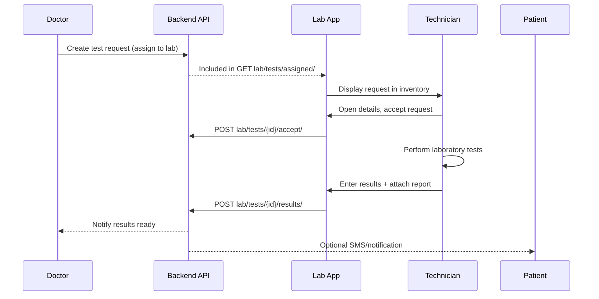
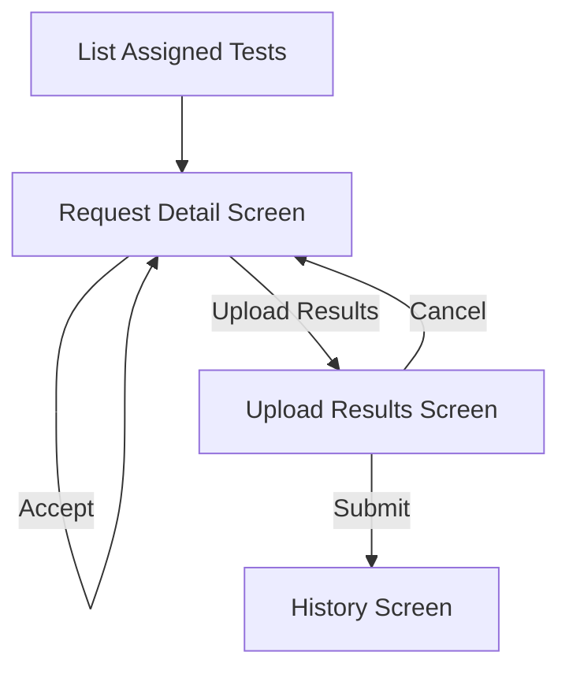

# Laboratory Test Upload Flow Documentation

## 1. Objective
Provide a complete blueprint for enabling laboratory users to review assigned test requests, capture results, and upload supporting evidence (documents/images) once tests are completed.

## 2. Personas & Preconditions
| Persona | Responsibilities | Key Needs |
| --- | --- | --- |
| Laboratory Technician | View assigned tests, perform diagnostics, submit results | Clear task list, simple result capture, ability to attach reports |
| Doctor | Reviews uploaded results, updates patient record | Reliable notifications, structured data |
| Patient | Receives final diagnosis/instructions | Timely delivery, readable reports |

**Preconditions**
1. Laboratory account is approved and profile completed.
2. Test requests are generated by Doctor workflow and appear in `lab/tests/assigned/`.
3. Laboratory app has valid auth token for API access.

## 3. High-Level Flow
1. **Assignment** – Assigned tests fetched via `GET lab/tests/assigned/`.
2. **Review** – Technician opens request details, validates patient & test list.
3. **Accept** (optional) – Technician confirms they will process the request (`POST lab/tests/{id}/accept/`).
4. **Perform Tests** – Work completed offline.
5. **Upload Results** – Technician enters findings and attaches files via new upload screen.
6. **Submit** – Results sent to API; status updated to `completed`/`delivered`.
7. **Doctor Review & Patient Notification** – Downstream modules consume the uploaded data.

## 4. Sequence Diagram


## 5. Screen Architecture
### 5.1 Assigned Tests Inventory (existing scaffold)
- **Data Source**: `LaboratoryUserProvider.testRequests` (assigned list).
- **Actions**: Pull-to-refresh, navigation to detail.
- **Enhancements**: Display status badges (Pending, In Progress, Completed).

### 5.2 Test Request Detail Screen (extend existing details view)
- **Sections**: Patient info, prescribed tests, doctor notes, request metadata.
- **Actions**: `Accept` (if not yet accepted), `Upload Results` (visible once accepted).
- **State**: Use Provider or dedicated ViewModel to manage status transitions.

### 5.3 Upload Results Screen (NEW)
**Layout Proposal**
1. **Header**: RX code, patient name, doctor name, due date (optional).
2. **Result Entry List**:
   - For each ordered test, render collapsible card.
   - Fields per test: `Observed Value`, `Reference Range`, `Units`, `Interpretation` (dropdown: Normal/Abnormal/Warning), `Notes`.
   - Support quick-fill defaults for common ranges.
3. **Attachments Section**:
   - Use existing `UploadDocumentScreen` for camera/gallery/PDF.
   - Allow multiple attachments; show file chips with type and size.
4. **Additional Notes**: Rich Text (optional) or plain textarea for overall remarks.
5. **Submission CTA**: “Submit Results” button with loading state.
6. **Validation**: Ensure at least one result or attachment provided.

### 5.4 Success & History
- After submission, navigate to confirmation page or detail screen with status `Completed` and attach link to view uploaded report.
- Completed tests appear in `LaboratoryHistoryScreen` (extend provider to fetch `lab/tests/history/`).

## 6. Data Model Requirements
### 6.1 Test Request (existing, expand if needed)
| Field | Type | Notes |
| --- | --- | --- |
| `id` | string/int | Unique request ID |
| `rx_code` | string | Prescription reference |
| `patient` | object | Name, age, gender, contact |
| `doctor` | object | Name, specialization |
| `tests` | array<TestItem> | Ordered laboratory tests |
| `status` | enum | pending / in_progress / completed |
| `notes` | string | Doctor remarks |
| `created_at` | datetime | Assignment timestamp |

### 6.2 Test Item
| Field | Type | Notes |
| --- | --- | --- |
| `id` | string | Unique per test |
| `name` | string | e.g., “CBC”, “Lipid Panel” |
| `code` | string | LOINC or internal code |
| `specimen` | string | Optional |
| `priority` | enum | Normal / Urgent |

### 6.3 Test Result Payload (new)
```json
{
  "test_request_id": "1234",
  "status": "completed",
  "overall_notes": "Patient should repeat in 3 months",
  "results": [
    {
      "test_item_id": "abc",
      "observed_value": "5.4",
      "unit": "mg/dL",
      "reference_min": "3",
      "reference_max": "6",
      "interpretation": "normal",
      "notes": "Within range"
    }
  ],
  "attachments": [
    {
      "file_id": "uuid",
      "file_name": "CBC_Report.pdf",
      "file_url": "https://...",
      "mime_type": "application/pdf"
    }
  ]
}
```

### 6.4 Attachment Metadata
- `file_id` (server-generated or upload response)
- `file_name`
- `mime_type`
- `size`
- `thumbnail_url` (optional for images)

## 7. API Blueprint
| Endpoint | Method | Purpose |
| --- | --- | --- |
| `lab/tests/assigned/` | GET | Currently used list of pending tests |
| `lab/tests/{id}/` | GET | Detailed request info (include test items & existing results) |
| `lab/tests/{id}/accept/` | POST | Mark request as in-progress |
| `lab/tests/{id}/results/` | POST | Submit final results (manual + attachments) |
| `lab/tests/{id}/attachments/` | POST | (Optional) Upload file, return metadata |
| `lab/tests/history/` | GET | Listing for Laboratory history tab |

**Request Format**
- Use JSON body with nested `results` array.
- For attachments, first upload via multipart endpoint; pass returned `file_id` in final payload.

**Response Expectations**
- `201 Created` with updated request object.
- Include aggregated status & timestamp (`completed_at`).
- Provide signed URLs for attachments (expirable if needed).

## 8. UI State Management
- Extend `LaboratoryUserProvider`:
  - `fetchTestRequestDetail(id)` → caches detail data.
  - `acceptTestRequest(id)` → updates state to `in_progress`.
  - `submitTestResults(payload)` → handles POST, toggles loading, error messages.
  - `refreshHistory()` → populate completed list.
- Optional dedicated `LaboratoryTestResultViewModel` for upload screen to manage form controllers, attachments, and validation.
- Re-use existing `UploadDocumentScreen` for capturing documents.

## 9. Validation & Error Handling
- Ensure numeric values use localized decimal separators.
- Validate `reference_min`/`reference_max` before comparison.
- Enforce attachment size (<10 MB recommended) and allowed types (`pdf`, `jpg`, `png`).
- Provide visual feedback: inline field errors, global SnackBar for network errors.
- Retry support for failed uploads (store draft results locally until submission succeeds).

## 10. Notifications & Audit
- On submission success, trigger backend events to notify doctor/patient.
- Persist audit trail (who submitted, timestamp, IP/device optional).
- Display submission metadata in history view (`Submitted by`, `Submitted at`).

## 11. Diagram: UI Module Structure


## 12. Implementation Roadmap
1. **Backend**
   - Add result submission endpoints & storage schema.
   - Implement file storage (S3/GCS) + signed URL return.
   - Integrate notifications (email/SMS/push).
2. **Frontend**
   - Create Upload Results screen with dynamic test list.
   - Extend Provider/ViewModel to support accept + submit flows.
   - Hook attachments via existing document uploader.
   - Add history tab consumption for completed tests.
3. **QA**
   - Validate end-to-end flows with real sample data.
   - Test error scenarios: invalid values, upload failure, lost connectivity.
   - Ensure accessibility (large text, color contrast, file preview).

## 13. Best Practices
- Keep manual entry fields simple; provide defaults to minimize typing.
- Permit both manual entry and document uploads; attach automatically generated PDFs if lab system already exports them.
- Support partial submissions (save draft) for lengthy panels.
- For imaging tests, allow DICOM export linking rather than raw file upload if files exceed size limits.
- Make results searchable by RX code and patient name.

---
This document should guide engineers and designers through implementing the laboratory test upload workflow in HatiCare.
